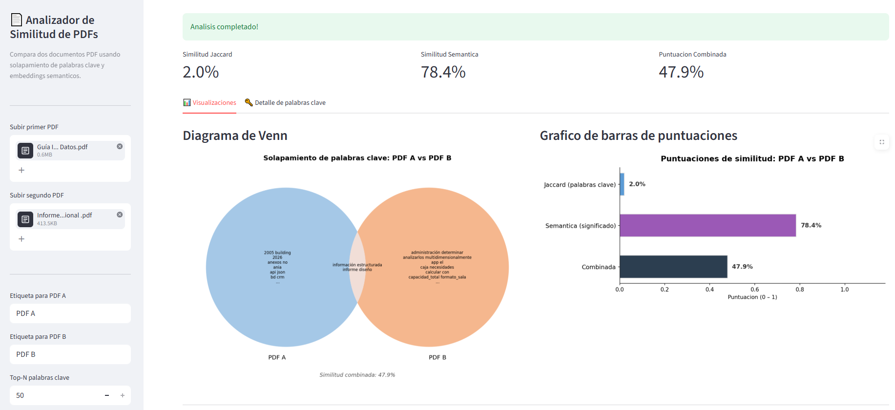

# Analizador de Similitud de PDFs

[](https://your-username-pdf-similarity-analyzer.streamlit.app)

Analiza la similitud tematica entre documentos PDF usando extraccion de palabras clave y similitud coseno de embeddings de sentence-transformer.

---

## 🚀 Demo en vivo

> **[Lanzar la app en Streamlit Cloud →](https://your-username-pdf-similarity-analyzer.streamlit.app)**


---

## Caracteristicas

- **Extraccion de texto** desde archivos PDF via PyMuPDF.
- **Extraccion de palabras clave** usando KeyBERT con sentence-transformers.
- **Similitud coseno** entre embeddings de documentos.
- **Visualizaciones**: graficos de barras de puntuaciones y diagramas de Venn de palabras clave compartidas.
- **Interfaz web Streamlit** para analisis interactivo basado en navegador.
- **Modo CLI** para uso en scripts / sin interfaz grafica.

## Capturas de pantalla

 **Captura de resultados para 2 pdfs** 



---

## Estructura del proyecto

```
pdf-similarity-analyzer/
├── .streamlit/
│   └── config.toml        # Configuracion de Streamlit
├── pdfs/                  # Coloca tus archivos PDF de entrada aqui
├── outputs/               # Graficos y diagramas generados
├── src/
│   ├── __init__.py
│   ├── extractor.py       # PDF → texto plano
│   ├── keywords.py        # Texto → palabras clave (KeyBERT)
│   ├── similarity.py      # Embeddings y similitud coseno
│   └── visualization.py   # Graficos de barras y diagramas de Venn
├── notebooks/
│   └── analysis.ipynb     # Notebook de analisis interactivo
├── app.py                 # Interfaz web Streamlit
├── main.py                # Punto de entrada CLI
├── Dockerfile
├── docker-compose.yml
├── requirements.txt
├── DEPLOY.md              # Guia de despliegue en la nube
├── .gitignore
└── README.md
```

---

## Primeros pasos

### Ejecutar localmente sin Docker

```bash
# 1. Crear y activar un entorno virtual
python -m venv .venv

# Windows
.venv\Scripts\activate
# macOS / Linux
source .venv/bin/activate

# 2. Instalar dependencias
pip install -r requirements.txt

# 3. Lanzar la interfaz web Streamlit
streamlit run app.py
```

La app se abrira en **http://localhost:8501**.

### Ejecutar via CLI

```bash
python main.py --pdf-a pdfs/doc1.pdf --pdf-b pdfs/doc2.pdf
```

Los resultados (graficos, diagramas de Venn, reporte) se guardaran en la carpeta `outputs/`.

---

## Docker

```bash
# Construir y ejecutar con Docker Compose
docker compose up --build

# O de forma independiente
docker build -t pdf-similarity .
docker run -p 8501:8501 pdf-similarity
```

Luego abre **http://localhost:8501**.

---

## Exploracion interactiva (opcional)

```bash
jupyter notebook notebooks/analysis.ipynb
```

---

## Requisitos

- Python >= 3.10
- Ver `requirements.txt` para la lista completa de dependencias.

## Licencia

Este proyecto es para fines academicos.
